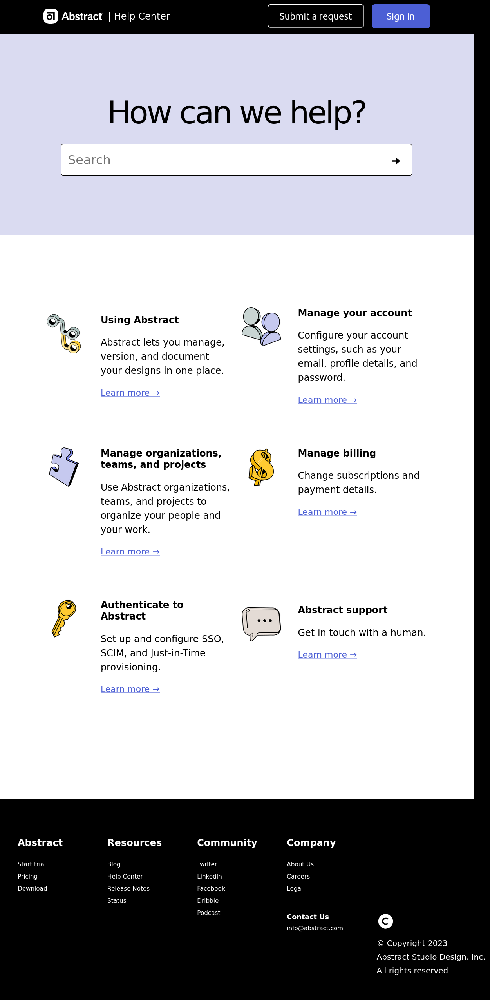

## Abstract_clone

It's just a simple project with cloning a website. Just a template of a website.

## How It's Made:

**Tech used:** HTML, CSS

I made this website with HTML and CSS using flexbox.
At first, I made the header for the site without any problems, with the exception of the logo itself, namely its size. The problems began when I started making a search bar, trying to align both the inscription and the strip itself in the container as on the original.
The next part was more of a problem with my monitor ratio, because I was using the old one with 5:4, so at 16:9 the site may not be close to the original as it was for me. Also the problem of adjusting the image to the container size with alignment.
The last part with the footer had exactly the same character as with the previous one, namely screen resolution. Maybe only the copyright container was a little problem to align to bottom realtively to other.

## Lesson Learned:

While working on this project I learned how to make a search bar and style it while adding the simple function like activating relative-link on search bar when you press enter. And inside the bar an icon of arrow.